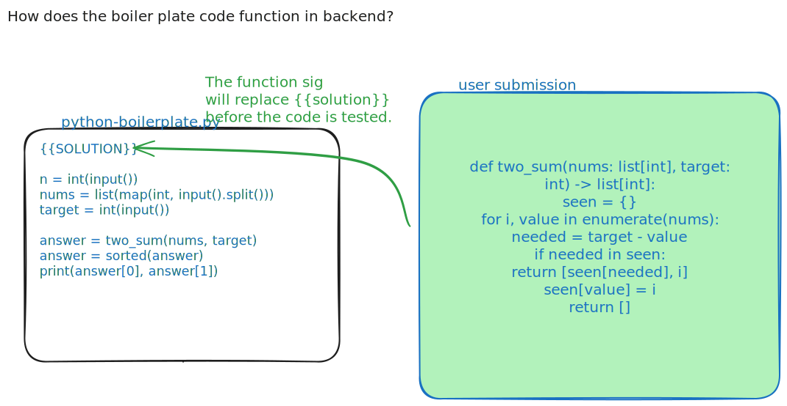
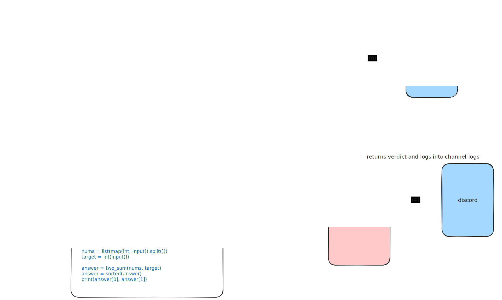

# This is how the Challenge cog works 

## Why this cog ?
- Automate the submission checking and point updation process through a command. 
- Log challenge submissiosn in a seperate channel 

## Procedure

### Problem setter
- The problem setter has to prepare the following files 
    - **statement.md** This file contains the problem statement in markdown format [example](./assets/challenge-examples/statement.md)
    - **boilerplate codes for each supported language** 
        - boilderplate codes are code that have the main function. and logic for taking in the input. 
        - the boilder plate code also has the logic of calling the function signature and passing in the parameters. 
        - We must add one boilder plate code per programming language. 
        - example [boilerplates](./assets/challenge-examples/)
        
        

    - **test-inputs.json**: This contains the test cases [format](./assets/challenge-examples/test-inputs.json)
    - **expected-output.json**: This contains the expected output for all test cases [format](./assets/challenge-examples/expected-outputs.json)
    
### user/ candidate / challenge submitter 
- The user just has to submit the function signature using commands
- They will get the verdict on their screen. 

## Pipeline illustrated 
Below is an naive understanding of the pipeline that powers all the challenge commands. 



## Backward compatibility

The challenge cog reuses the existing points database table and keeps challenge-specific data in its own challenge tables.

The old top-level leaderboard commands have been replaced by the new `/challenge ...` command group.

## Commands

All challenge commands are grouped under:

```text
/challenge
```

### Public commands

#### `/challenge rules`

Shows the challenge rules and submission guidelines.

**Usage**

```text
/challenge rules
```

#### `/challenge leaderboard`

Shows the current challenge points leaderboard.

**Usage**

```text
/challenge leaderboard
```

**Output**

Displays the top users ranked by points.

#### `/challenge points`

Shows points for yourself or another member.

**Usage**

```text
/challenge points
/challenge points member:@user
```

**Options**

| Option | Required | Description |
|---|---:|---|
| `member` | No | Member whose points should be checked. Defaults to yourself. |

#### `/challenge view`

Lists active problems, or shows/downloads a selected problem starter.

**List all problems**

```text
/challenge view
```

**View one problem**

```text
/challenge view problem:two-sum language:C++
```

**Options**

| Option | Required | Description |
|---|---:|---|
| `problem` | No | Problem title/slug. If omitted, lists active problems. |
| `language` | Required when `problem` is provided | Starter language to download. |

**Supported languages**

- Python
- JavaScript
- C++
- Java

#### `/challenge submit`

Submits a solution using a popup/modal form.

**Usage**

```text
/challenge submit problem:two-sum language:Python
```

After running the command, paste your function implementation into the popup.

**Options**

| Option | Required | Description |
|---|---:|---|
| `problem` | Yes | Problem title/slug. |
| `language` | Yes | Programming language of the submitted solution. |

**Behavior**

- Runs the submitted code against hidden tests.
- Uses the selected language boilerplate.
- Awards points only if all tests pass.
- Does not award duplicate points for already-solved problems.

#### `/challenge reveal-tests`

Reveals hidden test cases for a problem.

**Usage**

```text
/challenge reveal-tests problem:two-sum
```

**Options**

| Option | Required | Description |
|---|---:|---|
| `problem` | Yes | Problem title/slug. |

**Behavior**

- Requires two confirmations.
- Deducts 50 points the first time a user reveals tests for that problem.
- If the same user reveals the same problem again, no extra points are deducted.
- Sends the revealed tests as a file.

### Moderator commands

These require moderator/admin/staff permissions.

#### `/challenge add`

Creates or updates a coding problem.

**Usage**

```text
/challenge add
```

**Options**

| Option | Required | Description |
|---|---:|---|
| `title` | Yes | Problem title. |
| `statement` | Yes | Markdown/text file containing the problem statement. |
| `python_boilerplate` | Yes | Python starter/driver file containing `{{SOLUTION}}`. |
| `javascript_boilerplate` | Yes | JavaScript starter/driver file containing `{{SOLUTION}}`. |
| `cpp_boilerplate` | Yes | C++ starter/driver file containing `{{SOLUTION}}`. |
| `java_boilerplate` | Yes | Java starter/driver file containing `{{SOLUTION}}`. |
| `test_inputs` | Yes | JSON array of input strings. |
| `expected_outputs` | Yes | JSON array of expected output strings. |

**Test file format**

`test_inputs.json`

```json
[
  "4\n2 7 11 15\n9\n",
  "3\n3 2 4\n6\n"
]
```

`expected_outputs.json`

```json
[
  "0 1",
  "1 2"
]
```

**Boilerplate requirement**

Each boilerplate must contain:

```text
{{SOLUTION}}
```

The bot replaces that marker with the submitted function.

#### `/challenge remove`

Deactivates a problem.

**Usage**

```text
/challenge remove problem:two-sum
```

**Options**

| Option | Required | Description |
|---|---:|---|
| `problem` | Yes | Problem title/slug to remove. |

**Behavior**

- Soft-removes the problem by marking it inactive.
- Existing submissions/solves are not deleted.

#### `/challenge add-points`

Adds points to a user.

**Usage**

```text
/challenge add-points member:@user amount:100
```

**Options**

| Option | Required | Description |
|---|---:|---|
| `member` | Yes | User receiving points. |
| `amount` | Yes | Number of points to add. |
| `reason` | No | Optional reason for the award. |
| `silent` | No | If true, does not DM the user. Defaults to false. |

#### `/challenge remove-points`

Removes points from a user.

**Usage**

```text
/challenge remove-points member:@user amount:50
```

**Options**

| Option | Required | Description |
|---|---:|---|
| `member` | Yes | User losing points. |
| `amount` | Yes | Number of points to remove. |
| `silent` | No | If true, does not DM the user. Defaults to true. |

#### `/challenge test-pipeline`

Runs a smoke test of the challenge submission pipeline.

**Usage**

```text
/challenge test-pipeline
/challenge test-pipeline language:Python
```

**Options**

| Option | Required | Description |
|---|---:|---|
| `language` | No | Language to test. Defaults to all languages. |

**Behavior**

Tests the full judge flow using a small `add(a, b)` problem:

- Injects sample solution into boilerplate.
- Sends code to Hermes.
- Checks stdout.
- Prints per-language pass/fail and timing.
- Does not write submissions.
- Does not award or remove points.

### Notes

- Accepted submissions are logged to the challenge log channel.
- A full accepted solve awards 100 points.
- Duplicate accepted solves do not award points again.
- Test reveal costs 50 points only the first time per user per problem.
- Old top-level commands were replaced by `/challenge ...`.
